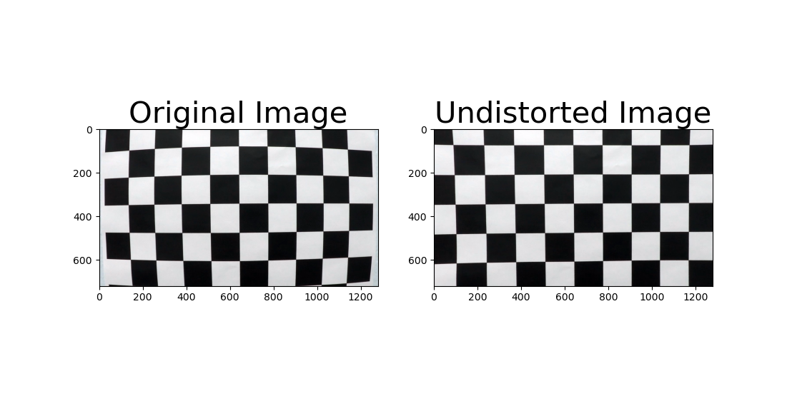
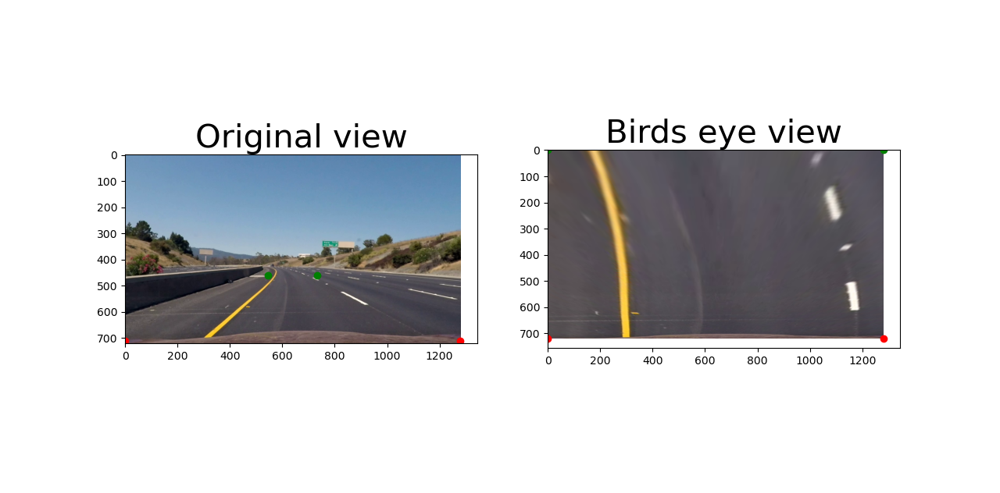
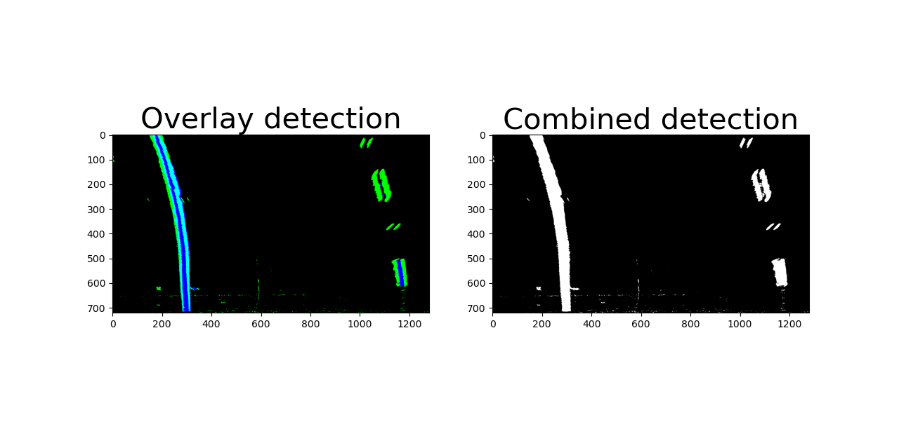
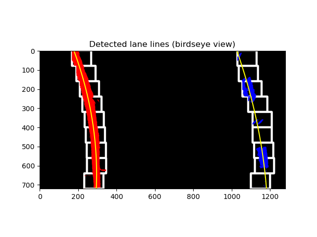
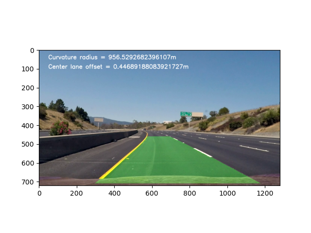

# Advanced Lane Finding
The goals / steps of this project are the following:

* Compute the camera calibration matrix and distortion coefficients given a set of chessboard images.
* Apply a distortion correction to raw images.
* Use color transforms, gradients, etc., to create a thresholded binary image.
* Apply a perspective transform to rectify binary image ("birds-eye view").
* Detect lane pixels and fit to find the lane boundary.
* Determine the curvature of the lane and vehicle position with respect to center.
* Warp the detected lane boundaries back onto the original image.
* Output visual display of the lane boundaries and numerical estimation of lane curvature and vehicle position.

### Navigating this project
* Project pipeline  is in `AdvancedLaneDetection.py`.
* Images for camera calibration are stored in `camera_cal`. 
* Images for testing the pipeline are in `test_images`.

## Project summary:

### Camera calibration
To calibrate the camera, calibration pattern points (objectPoints) are generated and its projections (imagePoints) are computed for each calibration image available  using `cv2.findChessboardCorners`.
These set of coordinates are passed to `cv2.calibrateCamera` to obtain the camera matrix and the distortion parameters. These parameters are passed to `cv2.undistort` function to correct the distortion caused by the camera.
The comparison between an original image and a distortion corrected image is presented below:

### Lane detection pipeline
For each image (or frame in case of a video):

* Correct for distortion (as described in camera calibration section).

* Transform perspective:

This step is performed on `changePerspective` function, which creates a set of 4 coordinates (source points) to define a polygon around the lane. Similarly, another set of 4 coordinates is chosen to be the destination coordinates for the source points. Then, `cv2.getPerspectiveTransform` computes the transform matrix (M) that maps the source coordinates into the destination coordinates.
Finally, the birds eye perspective is achieved by selecting the correct destination points and using `cv2.warpPerspective` along perspective transform matrix (M).

Note: the selection of source points was performed visually, therefore it is hard-coded.

An example of perspective transformation can be visualized below. The green and red dots on the image represent the source and destination points.

* Create a thresholded binary image:

`detectLane` function combines gradient and color filtering to extract the lane lines. Sobel filtering and colorspace transformation from RGB to HSV applied to the birds eye image are employed to extract the lane lines features.
Sobel filtering is performed to extract vertical edges and color filtering is applied to the saturation channel of the HSV image. The thresholds used for filtering were determined via trial and error.
Next, there is an example of the binary image thresholding, in which the plot on the left represents the gradient (green) and color (blue) detection. The plot on the right represents the binary image resulted from the combination of both filters.

* Lane lines detection and polynomial fitting:

While gradient and color filtering helps to identify lane lines in the image, other undesired features are also present in the binary image. To deal with this, there should be further detection to separate detect lane lines pixels from irrelevant pixels.
There are at least two ways to perform this task. If there is no previous knowledge about where the lane lines are, an extensive search is necessary. For this, `computeLines` firstly obtains the histogram of the binary image to find where the lane lines are most likely to be found. Thus, a window for searching relevant pixels in each lane line is created around this location. The pixels that are encountered inside each window are assumed to be lane line pixels. Next, these windows slides up in the image to continue the search for the target pixels.
On the other hand, if we are confident about the lane lines location, we can perform a more narrow search around this location using `computeLinesFaster`.
When the lane lines pixels are found, lane lines can be obtained by fitting a second order polynomial in each set of lane pixels detected. Figure below shows an example of the extended search method (sliding window) to detect lane lines pixels and the polynomial fit.

* Curvature radius and relative position of the vehicle

Using the second order polynomial fit from the step above, the curvature radius can be calculated by the following equation:

`( ( 1+(2*A*y+B)^2 )^(3/2) ) / ( abs(2*A) )` , where A, B and C are the polynomial fit coefficients given by x = Ay^2 + By + C. 
The curvature radius is computed at the vehicle location, therefore in the equation above, the value of y is choosen to be image's bottom y value.
The function `computeCurvatureRadius` performs the curvature radius calculation as well as the conversion from pixel to meter units.

The calculation of the relative position of the vehicle in respect to the lane center is given by the difference between the center of the car and the center of the lane, assuming that the camera is in line with the center of the car as well as with the center of the image. The function `computeLaneOffset` performs the following calculation:
`abs( ((img.shape[1])/2) - (x_left + ((x_right-x_left)/2) ) )`

## Pipeline output:
With the lane lines properly detected, the image is reverted back to the original perspective and distorted view. Finally, to allow a qualitative analysis of the performance of the pipeline the area between the lines are highlighted. 

A sample output of the pipeline can be observed below:

[Here is a link for a sample video output!](https://www.youtube.com/watch?v=HEGLcaYZbgk)
